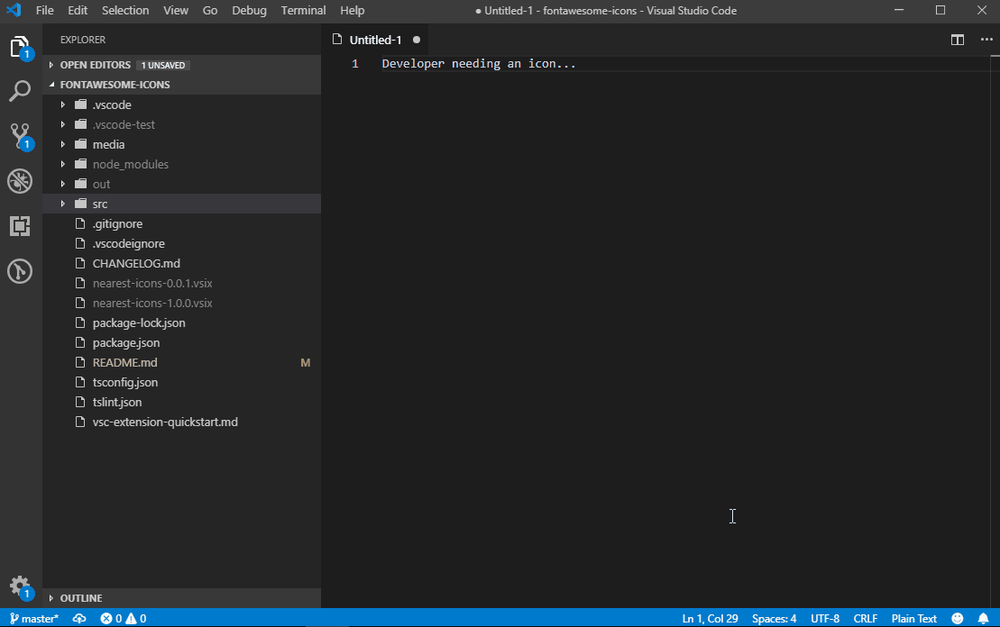

# Nearest Icons (Font-Awesome free icons)

Font Awesome icons snippet completions and icons panel displaying for discovering search.

## Features

 - Icons tab panel, where you have the both free font-awesome **brand** and **solid** icons bunch. Where you can:
   - Copy name, unicode and the tipic `i` snippet tag.
   - Directly open the Font-Awesome icon webpage.

## Requirements

 - Internet connection 
 - Visual Studio Code ^1.34

## Use 

 - Press `Ctrl + Shift + P` to call the command pallete 
 - Type *"Nearest icons"*, enough to get *"Nearest Icons - from Font-Awesome"* name in list

## Working on...

 - Offline use
 - Inline snippets completions

### See it on [VS Marketplace](https://marketplace.visualstudio.com/items?itemName=abax.nearest-icons)

## Licence

See the [LICENSE](LICENSE.md) file for license rights and limitations (MIT).

## Backlog

 - 1.0.2 Richer README.md
 - 1.0.1 Richer README.md
 - 1.0.0 First release
